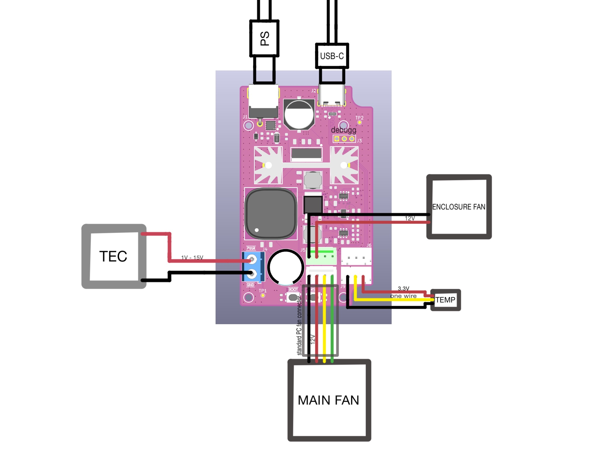

# Camera Cooler
Cooling solution for Svbony SV705C astronomy camera.

More about the project on my [website](https://luka.slibar.si/project.html?id=project1).

---

This repository contains multiple components, each under its own license.

- Firmware - GPL-3.0
- Hardware - CERN-OHL-S-2.0
- Software - GPL-3.0

See the ***project-folder/LICENSES*** directory for the full license texts.

---

This project is an attempt to actively cool the Svbony SV7505C astronomy camera. The cooling is intended to achieve better image quality by cooling the camera sensor through the bottom PCB. With this setup, we have achieved a temperature difference of 20°C, but we are still trying to improve the results through better insulation. A major problem is condensation, and great care must be taken to avoid short circuits on the camera's bottom PCB. The PCB can either be placed upside down or sealed with rubber or a similar material. The cooling system is powered by a 19V DC power supply capable of supplying at least 6 A of current.

We are currently developing the REV B PCB, which will eliminate some issues with incorrect connectors (fen connectors) and add the ability to completely disable the Peltier element (TEC) (with an additional MOSFET). At the moment, there are MicroPython example programs for controlling the device, but we are developing a C++ driver to make the system faster and more efficient. There is also a simple GUI, but the USB port currently needs to be configured manually.

PROBLEMS:
- Only 20°C of temperature difference(?broken TEC? Possible solution: change the TEC)
- Condensation is accumulating after long periods of runing the device(Possible solution: improve insulation, heat the other side of the camera)
- Slow response time (Possible solution: rewrite the driver in C++)
- Noisy fan (Possible solution: change it for a slower fan or a Noctua fan)
- TEC always on (Solution: REV B of the PCB will have an ability to completely power it off)

---

## Instructions
### Tools
- PCB Assembly: hot air gun, soldering iron, solder paste, soldering wire, flux
- Whole assembly: 3d printer, screwdrivers (philips, inbus)

### Additional Parts (not on the PCB)
TEC
- 15V 5A Paltier element (TEC) 40mm square

FANS
- S4028-15K (**12V 40mm 4pin PC connector** (any simmilar fan will also work)) (to cool the heatsink)
- Generic **12V 40mm 2/3/4pin 10mm height** fan (to cool the enclosure) 

HEATSINKS
- 25×34×12mm TO-220 heatsink (to cool the buck converter (XL4016E1) that powers the TEC) [link](https://www.aliexpress.com/item/1005005843184927.html?spm=a2g0o.order_list.order_list_main.70.6b821802gXbK9t#nav-description)
- Aluminium motherboard heatsink for a 40mm fan [link](https://www.aliexpress.com/item/1005009277375992.html?spm=a2g0o.order_list.order_list_main.95.6b821802gXbK9t)

THERMAL PAD AND PASTE
- 100x100mm 1.0mm thick pad [link](https://www.aliexpress.com/item/32988894487.html?spm=a2g0o.order_list.order_list_main.55.6b821802gXbK9t)
- PC thermal paste

THERMOMETER
- DS18B20 (**2 are already in the BOM** but only one is currently integrated)

INTERFACE
- **19V 6A** (at least) DC Power Supply with **2.54mm** barrel jack (for power) [link](https://www.aliexpress.com/item/1005004085574495.html?spm=a2g0o.order_list.order_list_main.90.6b821802gXbK9t)
- USB-C cable (for data and programming)
- **26 pin 0.5mm pitch 20cm** FFC(felxible flat cable) forward direction (to inteface between two camera PCBs) [link](https://www.aliexpress.com/item/1005008474655738.html?spm=a2g0o.order_list.order_list_main.60.6b821802gXbK9t)
- **3 pin-J Micro JST XH 2.54mm pitch** male plug with wire (to connect the thermometer to the PCB) [link](https://www.aliexpress.com/item/1005007107123815.html?spm=a2g0o.order_list.order_list_main.65.6b821802gXbK9t)

SCREWS
- Screws: [missing list]
- Threaded inserts: [missing list]

### PCB
PCB assembly is quite straightforward. The only exception is soldering the XL4016E1 and its heatsink. They should first be screwed together with a small amount of thermal pad or thermal paste between them. The assembly should then be placed on the PCB and soldered in place at the same time to prevent misalignment.

### Assembly
First, the camera needs to be disassembled. Its top cover and upper PCB, which is connected with a short ribbon cable, need to be removed. The aluminium cooling block and the 3D-printed cooling block holder can then be assembled. The 3d printed parts screwholes should be inserted with threaded inserts with a soldering iron or simmilar tool.

Place a thermal pad on the smaller side of the cooling block. The thermal pad should be cut to the same shape as that side of the block. There is a small hole on the side of the block for the temperature sensor, which must have wires soldered to it. A longer ribbon cable should be connected to the bottom PCB. A small amount of thermal paste can be applied between the temperature sensor and the cooling block to ensure more accurate temperature readings.

The entire assembly can now be fitted into the camera enclosure so that the screw holes are properly aligned. The main fan and heatsink can then be screwed together, and the fan cable can be routed through the upper hole into the PCB enclosure. The complete fan and heatsink assembly can then be fitted into the main enclosure.

The Peltier element (TEC) needs to be fitted to the bottom of the heatsink, with thermal paste applied between the two surfaces. There are holes for its wires alongside a slit for the longer ribbon cable. The camera and the cooler can then be joined together using thermal paste between their contact surfaces. The upper camera PCB and the custom TEC driver PCB have designated positions inside the enclosure on the side. An additional fan can also be installed to cool the enclosure.

---

### Electrical Connections

*TEC driver electrical connections*

---

### Mechanical Assembly

*Assembly of 3d printed parts and pcb*